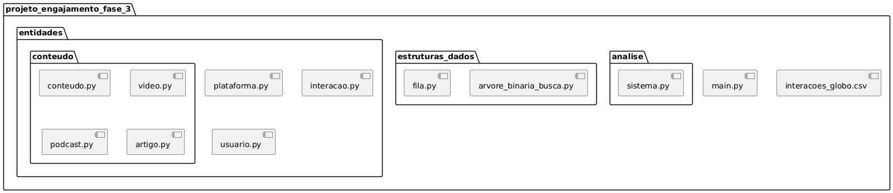
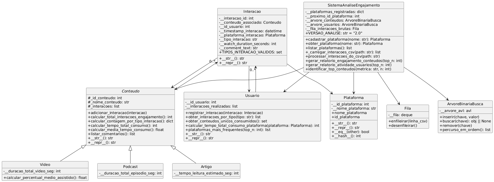

# Projeto Unificado - Fase 3: Análise de Engajamento de Mídias Globo com Estruturas de Dados

## 📌 Objetivo

Este projeto tem como finalidade aplicar os princípios de **Algoritmos e Estruturas de Dados** na análise de engajamento de mídias da Globo, otimizando o processamento e recuperação das informações por meio de estruturas como **Fila** e **Árvores de Busca Binária**.

**Módulo Foco:** DS-PY-003 — Introdução a Algoritmos e Estruturas de Dados

---

## 📂 Estrutura do Projeto

```
projeto_engajamento_fase_3/
│
├── main.py                        # Ponto de entrada da aplicação
├── interacoes_globo.csv           # Dados brutos de interações
│
├── entidades/                     # Sub-pacote com entidades do domínio
│   ├── __init__.py
│   ├── plataforma.py              # Classe Plataforma
│   |
|   ├── conteudo/                  # Sub-pacote com entidades do tipo conteudo
|   |   ├── conteudo.py            # Classe Conteudo
|   |   ├── video.py               # Classe Video (Conteudo)
|   |   ├── podcast.py             # Classe Podcast (Conteudo)
|   |   ├── artigo.py              # Classe Artigo (Conteudo)
│   ├── interacao.py               # Classe Interacao
│   └── usuario.py                 # Classe Usuario
|
├── estruturas_dados/              # Implementações de estruturas de dados
│   ├── __init__.py
│   ├── fila.py                    # Implementação de Fila (FIFO)
│   └── arvore_binaria_busca.py    # Implementação de Árvore de Busca Binária (BST)
│
├── analise/
│   ├── __init__.py
│   └── sistema.py                 # Classe SistemaAnaliseEngajamento (adaptada)
|
└── README.md
```


---

## 🧩 Principais Classes

- `Plataforma`: Representa plataformas de conteúdo como "G1" ou "Globoplay".
- `Conteudo` (abstrata) e subclasses: `Video`, `Podcast`, `Artigo`.
- `Interacao`: Representa ações dos usuários com conteúdos.
- `Usuario`: Agrega interações por usuário.
- `SistemaAnaliseEngajamento`: Classe de orquestração, leitura de dados e geração de relatórios.



---

---

## 🔄 Fluxo de Processamento

1. **Leitura e Enfileiramento de Dados**
   - Os dados são lidos linha por linha do `CSV` e armazenados em uma **Fila** (`FIFO`).
2. **Processamento com Árvores de Busca**
   - Usuários e Conteúdos são armazenados em **Árvores de Busca Binária**, otimizando buscas e inserções.
3. **Geração de Relatórios**
   - São gerados relatórios com base em algoritmos de ordenação, como **Quick Sort** e **Insertion Sort**.

---

## 🧱 Estruturas de Dados Utilizadas

### 📌 Fila (Queue)

- Processa os dados de forma sequencial.
- Operações principais:
  - `enfileirar(linha_csv)`
  - `desenfileirar()`
  - `esta_vazia()`

### 🌳 Árvores de Busca Binária (BST)

- Armazenam usuários e conteúdos usando chaves únicas (_id_usuario, _id_conteudo).
- Operações principais:
  - `inserir()`
  - `buscar()`
  - `remover()`
  - `percurso_em_ordem()`

---

## 📊 Relatórios Gerados

- **Top conteúdos por tempo de consumo**
- **Usuários com maior tempo total de consumo**
- **Plataforma com maior engajamento**
- **Conteúdos mais comentados**
- **Total de interações por tipo de conteúdo**
- **Tempo médio de consumo por plataforma**
- **Quantidade de comentários por conteúdo**

---

## ⚙️ Algoritmos de Ordenação

- **Quick Sort**: Utilizado para ordenar grandes volumes de dados de conteúdos.
- **Insertion Sort**: Utilizado para listas pequenas ou demonstração de eficiência.

Cada algoritmo utilizado está documentado com sua **complexidade de tempo e espaço**, utilizando notações `O`, `Ω` e `Θ`.

---

## 🔎 Análise de Complexidade

Para cada estrutura e algoritmo implementado, é fornecida uma análise de complexidade computacional, contribuindo para a compreensão do impacto da escolha de estrutura nos tempos de execução e uso de memória.

---

## 🚀 Como Executar

1. Clone o repositório:
   ```bash
   git clone https://github.com/seu-usuario/projeto_engajamento_fase_3.git
   cd projeto_engajamento_fase_3
   ```

2. Certifique-se de que o Python 3 está instalado:
   ```bash
   python3 --version
   ```

3. Execute o projeto:
   ```bash
   python main.py
   ```

---

## 🧠 Aprendizados Esperados

- Implementação e aplicação prática de **estruturas de dados fundamentais**
- Análise e melhoria de **eficiência algorítmica**
- **Engenharia de software modularizada**, usando pacotes e subpacotes
- Capacidade de **tomada de decisão** baseada em dados

---

## 🎓 Avaliação

| Critério                            | Peso |
| ----------------------------------- | ---- |
| Correção e funcionamento do código  | 3.0  |
| Uso correto de estruturas de dados  | 2.0  |
| Algoritmos de ordenação             | 1.0  |
| Algoritmos de busca                 | 1.0  |
| Clareza e organização do código     | 1.0  |
| Documentação e justificativas       | 1.0  |
| Relatórios e interpretação de dados | 1.0  |

---

## Equipe de colaboradores

|  |  |  |  |  |  |
| :-----------------------------------------------------------------------------------------------------------------------------------: | :------------------------------------------------------------------------------------------------------------------------------: | :--------------------------------------------------------------------------------------------------------------------------------: | :----------------------------------------------------------------------------------------------------------------------------: | :--------------------------------------------------------------------------------------------------------------------------------: | :-------------------------------------------------------------------------------------------------------------------------------: |
|                            <a href="https://github.com/EdOliveiraJr" target="_blank"> Edvaldo Oliveira</a>                            |                            <a href="https://github.com/malufazenda" target="_blank"> Malu Fazenda</a>                            |                           <a href="https://github.com/daniels070" target="_blank"> Daniel Brambila </a>                            |                           <a href="https://github.com/danilodpx" target="_blank"> Danilo Pinho </a>                            |                           <a href="https://github.com/LucasSandes07" target="_blank"> Lucas Sandes </a>                            |                           <a href="https://github.com/eufmartins" target="_blank"> Felipe Martins </a>                            |

---

## 📝 Licença

Este projeto é apenas para fins educacionais.
